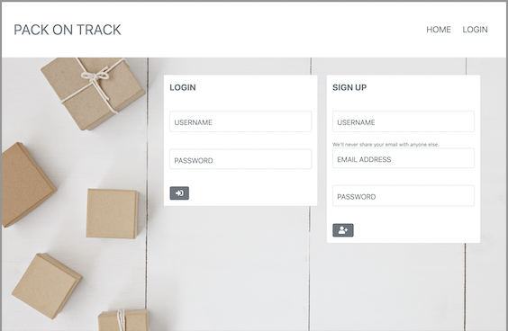

<div style="text-align:center"><a href="........"></a></div>

<h1>PACK ON TRACK</h1>


<h2>Table of Content</h2>

- [Project Link](#project-link)
- [Getting Started](#getting-started)
- [Contributors](#contributors)
- [About The project](#about-the-project)

  - [User Story](#user-story)
  - [Technologies Used](#technologies-used)
  - [Web APIs](#web-apis)
  - [Wireframes](#wireframes)

- [Plans For Improvement](#plans-for-improvement)
- [Screenshots](#screenshots)

  - [Homepage](#homepage)
  - [Dashboard](#dashboard)
  - [Profile](#profile)
  - [Sign In/ Sign Up](#sign-in-sign-up)
  - [About Us](#about-us)
  - [FAQ](#faq)
  - [Shipment](#shipment)
  - [Address](#address)

<br>

### Project Link

[Link](https://) to our live app.
These are our project's [presentation]() and our [GitHub repo]().

<br>

### Getting Started

This is a live website, therefore accessible directly on its [live URL]().
Should you like to experiment and check the code, feel free to clone the repo to your local machine and open the project in your VSCode:

```
git clone git@github.com:JenBerlin/Pack-On-Track.git
cd Pack-On-Track
code .
```

### Contributors

- Jenny : https://github.com/JenBerlin
- Jitka : https://github.com/jitasek
- Mohamed : https://github.com/mohamedallam13
- Vicente : https://github.com/vvicunag

<br>

### About The Project

Pack On Track is a handy light-weight web app which keeps track of all your active online orders for you. It takes over the burden from your shoulders of having to remember when your next order is getting shipped to which of your addresses, by which courier company and many other fancied features.

<br>

### Key Features (in bullet points)

#### User Story

As a spirited online shopper, I want to keep track of my current orders. I want to have an overview of all my orders' data aggreagted and saved in one place to be able to access, update or delete my upcoming shipments anytime.

<br>

#### Technologies Used

<p>The following technologies and frameworks were used while working on this project:</p>

- HTML, CSS (Bootstrap UI Framework)
- JavaScript
- npm package manager
- Express.js
- express-handlebars
- express-sessions
- connect-session-sequelize
- MVC architectural pattern
- Sequelize ORM
- MySQL
- bcrypt package
- dotenv package
- Insomnia API Design Platform
- eslint, nodemon (dev dependencies)

<br>

#### Web APIs

- The following API is implemented in this project:
- [Shippo](https://goshippo.com/docs/test-mode/)

<br>

#### Wireframes

TBD

<br>

### Plans For Improvement

- overdue orders in a red section
- tracking of where the parcel is at the moment
- email plugin to transfer order confirmation data into the App and account
- adjusting dekiuvery date directly through the app
- delivery pickupo notification
- Slack message/ email notification for this week's shipments
- password re-type security feature on login page ?
- user confirmation/verification request after sign-up (users click a link emailed to them)
- developing a mobile app

<br>

### Screenshots

- Homepage 

- Dasboard 

- Profile 

- Sign In/ Sign Up 

- About Us 

- FAQ 

- Shipment 

- Address 
